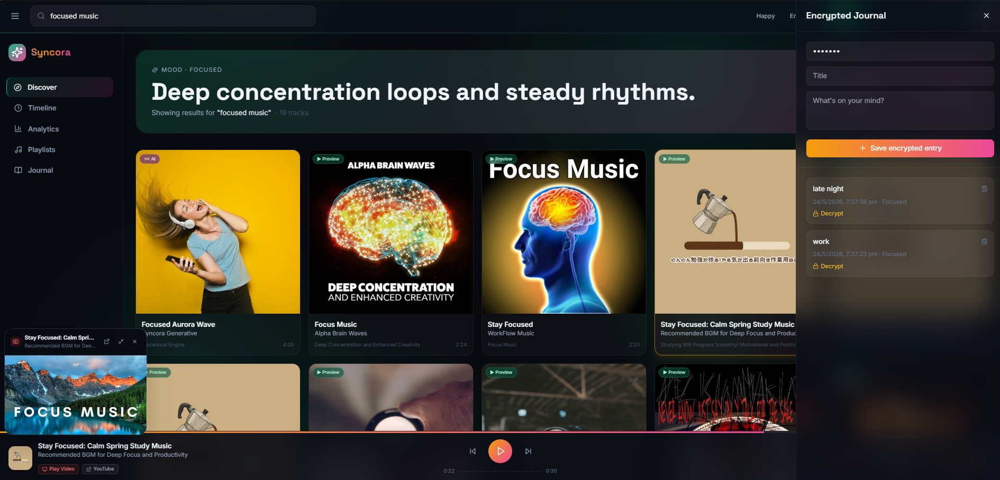

# Syncora — MERN Mood Music Platform

A full-stack MERN app converted from the original single-file React prototype.
MongoDB + Express backend, React (Vite + JSX) frontend with Tailwind.

## Quick start

### 1. Backend
```bash
cd backend
npm install
# Optional: copy .env.example to .env and set MONGO_URI / JWT_SECRET
npm run dev
```
Server runs on `http://localhost:5000`. If `MONGO_URI` is not set or
MongoDB is unreachable, the server automatically falls back to a local
JSON-file store in `backend/data/`. Everything still works.

### 2. Frontend
```bash
cd frontend
npm install
npm run dev
```
Opens on `http://localhost:5173`. Vite proxies `/api` -> backend.

## Dashboard





## Fixes vs. the original prototype

1. **"Music playing but not audible"** — `AudioContext` is now always
   resumed inside a user gesture (Play button), master gain raised
   from 0.45 → 0.85, and oscillator gains boosted ~3x. The `<audio>`
   element is also explicitly unmuted on play.
2. **"Same audio every time"** — track-based deterministic seeding is
   honored (different scale + tempo per title), AND the stream engine
   now actually swaps `audio.src` *and* calls `audio.load()` before
   `audio.play()`. The procedural fallback rebuilds the chord pool from
   the new track's hash on every play. Each iTunes search returns
   unique 30s previews per track.
3. UI polish: rounder cards, gradient mood orbs, animated player deck,
   improved sidebar, glassy header.

## Folder layout
See the structure in this repository — `backend/` and `frontend/` are
fully independent npm projects.
