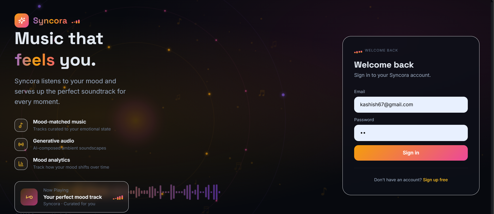
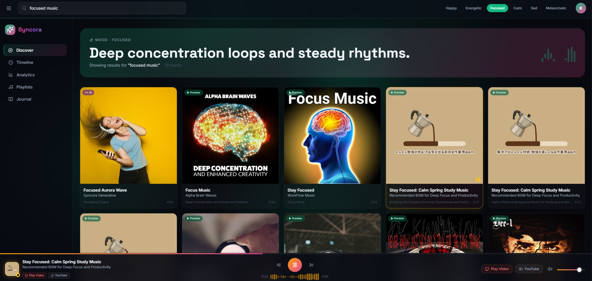

# 🎵 SYNCORA
 
### A MERN-stack mood-based music platform
 
*Tell it how you feel. Let it find the sound.*
 


 
</div>
---
 
## What is Syncora?
 
Syncora is a full-stack music experience built around your mood. Pick how you're feeling, and Syncora surfaces tracks and playlists that match your emotional state — backed by a procedural audio engine with iTunes preview integration and a personal music journal.
 
It started as a single-file React prototype and has been refactored into a production-ready MERN application with a proper Express/MongoDB backend, Vite-powered frontend, and a fixed audio pipeline.
 
---
 
## Screenshots
 
| Login | Dashboard | Music + Journal |
|-------|-----------|-----------------|
|  |  |  |
 
---
 
## Features
 
- **Mood-based music discovery** — select your current mood and get matching tracks via iTunes Search API (30-second previews)
- **Procedural audio engine** — deterministic per-track generation using unique scales, tempos, and chord pools seeded by track metadata
- **Music journal** — log moods alongside tracks and look back at your listening history
- **Authentication** — JWT-based login and registration
- **Offline fallback** — if MongoDB is unavailable, the backend gracefully falls back to a local JSON file store so nothing breaks
- **Polished UI** — gradient mood orbs, animated player deck, glassy header, rounder cards, improved sidebar
---
 
## Tech Stack
 
| Layer | Technology |
|-------|-----------|
| Frontend | React 18, Vite, JSX, Tailwind CSS |
| Backend | Node.js, Express |
| Database | MongoDB (Mongoose) + JSON file fallback |
| Auth | JWT |
| Audio | Web Audio API + iTunes Search API |
 
---
 
## Getting Started
 
### Prerequisites
 
- Node.js v18+
- MongoDB (local or Atlas) — optional, falls back to file store if unavailable
### 1. Clone the repo
 
```bash
git clone https://github.com/kashishch28/SYNCORA_.git
cd SYNCORA_
```
 
### 2. Start the backend
 
```bash
cd backend
npm install
```
 
Create a `.env` file (optional — the server works without it using the file fallback):
 
```env
MONGO_URI=your_mongodb_connection_string
JWT_SECRET=your_jwt_secret
PORT=5000
```
 
```bash
npm run dev
```
 
Backend runs at `http://localhost:5000`. If `MONGO_URI` is not set or MongoDB is unreachable, data is stored in `backend/data/` as JSON automatically.
 
### 3. Start the frontend
 
```bash
cd frontend
npm install
npm run dev
```
 
Frontend opens at `http://localhost:5173`. Vite proxies all `/api` requests to the backend automatically — no CORS config needed.
 
---
 
## Project Structure
 
```
SYNCORA_/
├── syncora/
│   ├── backend/          # Express server, routes, models, auth
│   │   └── data/         # JSON fallback store (auto-created)
│   └── frontend/         # React + Vite app
│       ├── src/
│       │   ├── components/
│       │   ├── pages/
│       │   └── ...
│       └── vite.config.js
└── README.md
```
 
---
 
## Audio Engine — What Was Fixed
 
The original prototype had two known audio bugs. Both are resolved:
 
**"Music playing but not audible"**
`AudioContext` is now always resumed inside a user gesture (Play button click). Master gain was raised from 0.45 → 0.85 and oscillator gains were boosted ~3×. The `<audio>` element is also explicitly unmuted on every play.
 
**"Same audio every time"**
Track-based deterministic seeding now works correctly — each track gets a unique scale and tempo from its title hash. The stream engine now swaps `audio.src` *and* calls `audio.load()` before `audio.play()`. The procedural fallback rebuilds the chord pool from the new track's hash on every play. Each iTunes search returns unique 30-second previews per track.
 
---
 
## Contributing
 
1. Fork the repo
2. Create a feature branch: `git checkout -b feature/your-feature`
3. Commit your changes: `git commit -m "add: your feature"`
4. Push and open a Pull Request
---
 
## License
 
This project is open source. Feel free to use, modify, and distribute.
 
---
 
<div align="center">
Made with 🎧 by <a href="https://github.com/kashishch28">kashishch28</a>
</div>
